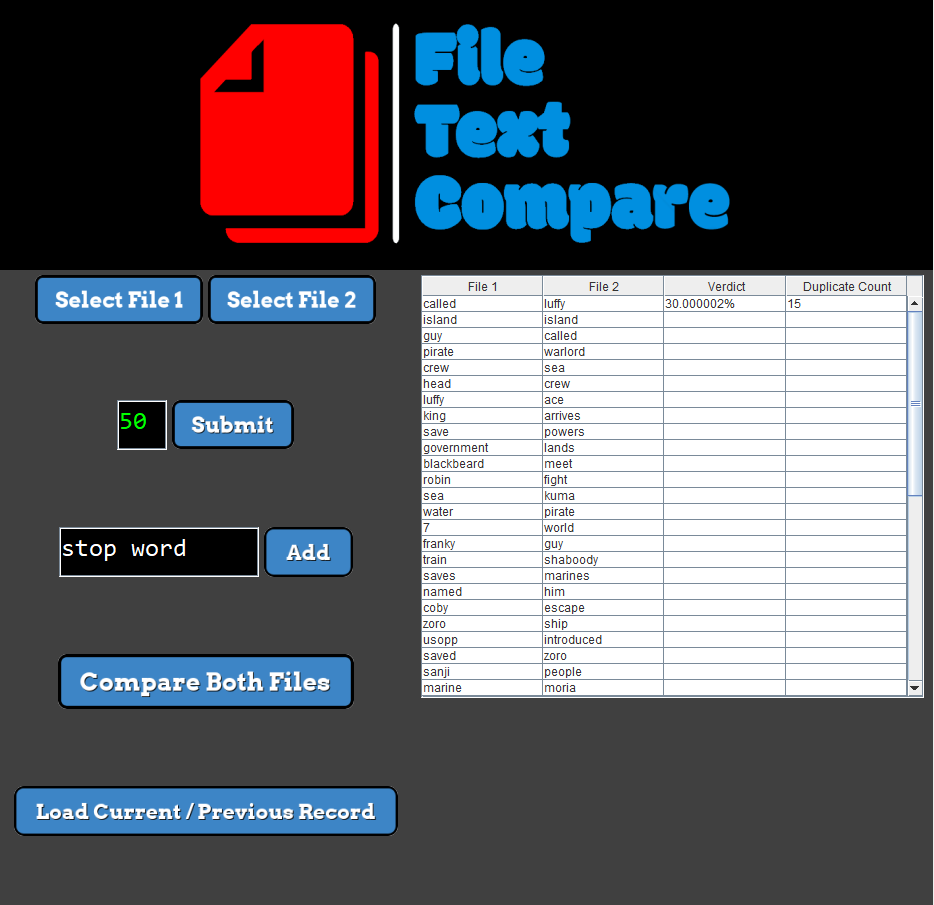

# Topic Modeller
 Java Assignment for OOP Yr 2 Sem 2
 by Roman Holub Ploshko
 C20390201
 
 
 
 ----------------------------------------------------------
 
 Programs Goal:
 
 Accept 2 text files from User,
 
 Count top N amount of duplicates in both,
 
 Optional stop word insert,
 
 & Compare top N duplicates,
 
 Display % of similarity
 
 - All optional/additonal features were implemented,
 - JTable
 - File Persistence
 ----------------------------------------------------------
 
 ++++++++++++++++++++++++++++++++++++++++++++++++++++++++++
 
General order of operations:

- (BUTTON 1) - Select File 1 w/ FileChooser & get File Path
Send File Path to FiletoList method in FileProcessor, File 1 is read into an arrayList, all elements in Arraylist are lowercased and returned back to GUI.

- (BUTTON 2) - Select File 2 w/ FileChooser
Send File Path to FiletoList method in FileProcessor, File 2 is read into an arrayList, all elements in Arraylist are lowercased and returned back to GUI.

- (BUTTON 3) - Alter/Choose top N value - that selects top N amount of elements to later compare in both files, altered - as default is set to 10
Error checking is implemented to check and only accepts a positive integer value for top N input - the int also has to be smaller then the sizes of the file ArrayLists.

- (BUTTON 4) - A submit button that converts stop_words.txt file to an ArrayList and adds a stop word (that was inputted in button 4 - JTextField) to the ArrayList.

- (BUTTON 5) - Compare Both Files Button - this is where most of Topic Modeller's main functionality is executed.
Stop words (in an ArrayList) are removed from File 1 AND File 2 - this method (RemoveStopWords) also removes punctuation.
File 1 with topN (specified in Button 3) is passed on to CountDuplicates method is called in DuplicateProcessor class - A linked Hash Map is used to count duplicates as keys for every word as values, for every word in the file ArrayList is put into the Hash Map and if the word appears multiple times within the array (duplicates) the word count for this word is incremented. 
A linked hash map is used so that the order is later maintained, this ArrayList is used to sort the Map in reverse order with Stream API and a comparator, words in the map are KEYS and the word count is the VALUES - and so KEYS are sorted by the VALUE.
The KeySet from the SortedDuplicateMap are added into an ArrayList by converting this Linked Hash Map into an an ArrayList.
The file ArrayList is cleared to remove the original unsorted list and afterwards - using a for loop - only the top N amount of duplicates are added to this File List from the the sorted (converted from Linked Hash Map to temporary ArrayList) ArrayList.
The processed File ArrayList is returned back to GUI to the respective File ArrayList.

After both File ArrayLists are processed - they are passed with Top N int to compareList method in DuplicateProcessor class, this method was created to calculate the file similarity percentage (as a float value). Within the compareList, File 1 ArrayList is cloned into a seperate ArrayList - "retainList", this list then uses the retainAll functionality to leave only matching elements that are only present in both File 1 and File 2. The File Similarity percentage is calculated by dividing the size of the "retainList" BY the user-specified top N integer - and multiplying by 100, the result value is stored in a float variable "verdict". Within the compareList method, near the end this statistic (float verdict value), the total amount of matching words in both files ("retainListSize") are passed on into a float array - "statsArray", this array is returned back to the GUI and updates the statsArray array.
RetainListSize was returned as float value - to achieve a multiple return, afterwards within the GUI this variable is converted back into a integer.
Shortly after an evaluation of the verdict float value is displayed in the GUI.

Lastly to achieve file persistence, primary data must be saved into a database - storing values in a csv file.
Calling SaveRecords method in FileProcessor, this method takes in both File ArrayLists, the float verdict value and duplicateInt (previously converted from a float).
These are inserted and are written into the csv file - row by row, each row has an element from both the passed on File ArrayLists and the verdict and duplicateInt value are only included once - in the first row. Error Checking is in place to assure the user that the record was successfully saved into the csv file. A common reason why the record could not be saved is if the user has the file open. As data is written to the csv file, previous data is replaced by new data - specified in a parameter.

- (BUTTON 6) - Used to load previous OR Current records, this button can also be used at the start of the program to demonstrate File Persistence - by loading the previous record. The data (that was previously written to the csv file) is read row by row into each string array, these string arrays are inserted into a multi-dimensional array - that is returning to GUI's multi-dimensional array. The 2D array in GUI is used to update the JTABLE and the user after the press sees the populated JTable.
 ++++++++++++++++++++++++++++++++++++++++++++++++++++++++++
